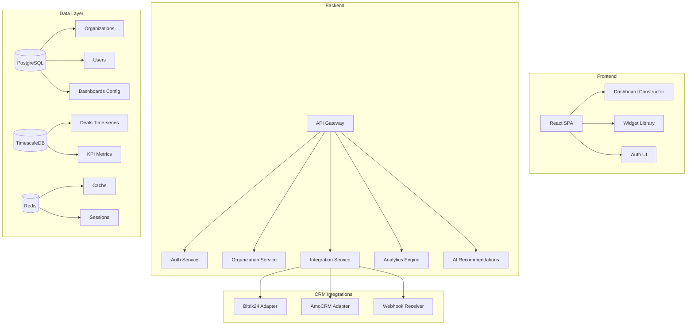
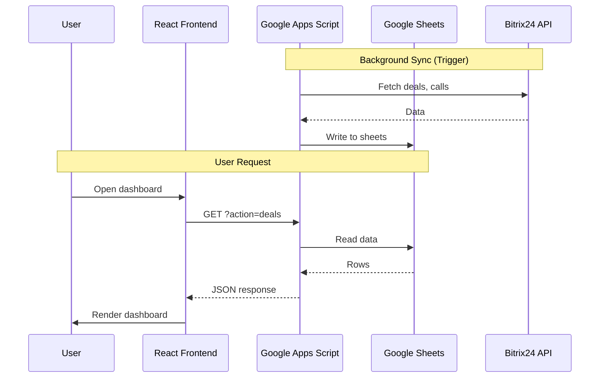

# Sales Analytics SaaS Platform - Product Analysis & MVP Specification

## Executive Summary

**Цель**: Создать онлайн-сервис аналитики для отделов продаж с возможностью подключения CRM-систем (AmoCRM, Битрикс24) через webhook/API. Платформа предоставляет конструктор дашбордов, систему мотивации и ИИ-рекомендации для роста продаж.

---

## 1. Product Vision (Видение продукта)

### 1.1 Проблемы, которые решает сервис

| Проблема | Решение |
|----------|---------|
| Данные разбросаны по CRM, таблицам, отчётам | Единый дашборд с интеграцией |
| Нет прозрачности по KPI и мотивации | Автоматический расчёт ЗП, бонусов, KPI |
| Руководитель не видит "узкие места" | ИИ-аналитика и рекомендации |
| Каждый бизнес уникален | Конструктор дашбордов "под себя" |
| Долгая настройка интеграций | Подключение CRM в 1 клик через OAuth/webhook |

### 1.2 Целевая аудитория

- **Первичная**: РОП (руководители отделов продаж) малого и среднего бизнеса
- **Вторичная**: Директора по продажам, собственники бизнеса
- **Пользователи**: Менеджеры по продажам (просмотр своих показателей)

### 1.3 Value Proposition

> **"Подключи CRM → Настрой дашборд → Получай рекомендации по росту продаж"**

---

## 2. Feature Specification (Функциональность MVP)

### 2.1 Core Features (Ядро MVP)

#### 📊 **Dashboard Core**
| Фича | Описание | Приоритет |
|------|----------|-----------|
| **Виджеты аналитики** | Объём продаж, маржа, средний чек, конверсии | P0 |
| **Воронка продаж** | Визуализация этапов с количеством и конверсиями | P0 |
| **Таблица сделок** | Фильтрация, сортировка, детализация по менеджерам | P0 |
| **Карточки менеджеров** | Производительность каждого сотрудника | P0 |
| **Период отчётности** | Выбор дат, применение фильтров | P0 |

#### 🔗 **CRM Integrations**
| CRM | Метод интеграции | Данные |
|-----|------------------|--------|
| **Битрикс24** | REST API + OAuth 2.0 | Сделки, звонки, контакты, менеджеры |
| **AmoCRM** | REST API + OAuth 2.0 | Сделки, задачи, воронки, пользователи |
| **Webhook-режим** | Входящие события | Real-time синхронизация изменений |

#### 💰 **Motivation System (Система мотивации)**
| Компонент | Формула | Настраиваемость |
|-----------|---------|-----------------|
| **Фикс (оклад)** | `base_rate × worked_days / norm_days` | База, норма дней |
| **KPI-бонусы** | Звонки × ₽, КП × ₽, конверсии | Ставки, лимиты на блок |
| **Маржинальные бонусы** | `margin × rate(margin_percent)` | Шкала процентов |
| **Общий лимит KPI** | MAX_FLEX_KPI | Настраивается |

#### 👤 **Multi-tenant Architecture**
| Сущность | Описание |
|----------|----------|
| **Organization** | Компания-клиент сервиса |
| **Workspace** | Отдел продаж внутри организации |
| **User** | Пользователь с ролью (owner, admin, manager) |
| **Integration** | Подключение к CRM |
| **Dashboard** | Настроенный дашборд |

---

### 2.2 Dashboard Constructor (Конструктор)

#### Виджеты первой очереди
```
┌─────────────────────────────────────────────────────────────┐
│  📊 Metric Card    │  📈 Line Chart   │  🥧 Pie Chart      │
├─────────────────────────────────────────────────────────────┤
│  📋 Data Table     │  🏆 Leaderboard  │  📉 Bar Chart      │
├─────────────────────────────────────────────────────────────┤
│  🎯 KPI Gauge      │  🔄 Funnel       │  💵 Currency Card  │
└─────────────────────────────────────────────────────────────┘
```

#### Механика конструктора
1. **Drag & Drop** - перетаскивание виджетов на canvas
2. **Grid Layout** - адаптивная сетка (12 колонок)
3. **Widget Settings** - источник данных, агрегация, период
4. **Save/Load** - сохранение конфигурации в JSON
5. **Templates** - готовые шаблоны дашбордов

---

### 2.3 AI Analytics (Фаза 2)

#### Рекомендательный движок
| Тип рекомендации | Триггер | Действие |
|------------------|---------|----------|
| **Производительность** | Drop в звонках > 20% | "Менеджер X снизил активность" |
| **Конверсия** | Conv rate < target | "Воронка на этапе Y - узкое место" |
| **Прогноз** | Trend analysis | "План на месяц под угрозой: -15%" |
| **Best practices** | Top performer analysis | "Топ-менеджер делает X, рекомендуем другим" |

---

## 3. Technical Architecture (Архитектура)

### 3.1 Target Architecture



### 3.2 Technology Stack (Target)

| Layer | Technology | Reasoning |
|-------|------------|-----------|
| **Frontend** | React 19 + TypeScript | ✅ Уже используется |
| **UI Framework** | Tailwind CSS + shadcn/ui | ✅ Уже используется |
| **State** | Zustand / TanStack Query | Замена простых useState |
| **Backend** | Node.js + NestJS / Fastify | Структурированный API |
| **Database** | PostgreSQL + Prisma | Multi-tenant, типизация |
| **Time-series** | TimescaleDB | Агрегация метрик |
| **Cache** | Redis | Sessions, hot data |
| **Auth** | Clerk / Auth.js | OAuth, RBAC |
| **Hosting** | Vercel (FE) + Railway (BE) | Масштабирование |
| **AI** | OpenAI API / LangChain | Рекомендации |

---

## 4. Current State Analysis (Анализ текущего кода)

### 4.1 Codebase Structure

```
d:\Coding\Dashboard\
├── dashboard-app/              # Frontend (React + Vite)
│   ├── src/
│   │   ├── components/         # 11 компонентов
│   │   │   ├── AdminPanel.tsx      # Управление пользователями
│   │   │   ├── SalesChart.tsx      # График продаж
│   │   │   ├── DealsTable.tsx      # Таблица сделок
│   │   │   ├── KpiWidget.tsx       # Виджет KPI
│   │   │   └── MetricsCards.tsx    # Карточки метрик
│   │   ├── hooks/              # 7 кастомных хуков
│   │   │   ├── useDeals.ts         # Загрузка сделок
│   │   │   ├── useKPI.ts           # Загрузка KPI
│   │   │   └── useSalary.ts        # Загрузка зарплат
│   │   ├── pages/
│   │   │   └── SalesDashboard.tsx  # Главная страница (1260 строк!)
│   │   ├── services/
│   │   │   └── api.ts              # API клиент
│   │   ├── types/              # TypeScript типы
│   │   └── utils/
│   │       └── salaryCalc.ts       # Расчёт зарплаты
│   └── package.json
│
└── report_scripts/             # Backend (Google Apps Script)
    ├── api.js                  # Web App API (525 строк)
    ├── sync_deals.js           # Синхронизация сделок
    ├── sync_calls.js           # Синхронизация звонков
    ├── kpi_daily.js            # Ежедневный KPI
    ├── kpi_monthly.js          # Месячный KPI
    └── schema.js               # Схема данных
```

### 4.2 Current Features ✅

| Feature | Status | Implementation |
|---------|--------|----------------|
| **Sales Dashboard** | ✅ Complete | `SalesDashboard.tsx` |
| **Deals Table** | ✅ Complete | Сортировка, фильтрация |
| **Funnel Visualization** | ✅ Complete | 8 этапов воронки |
| **Manager Cards** | ✅ Complete | С детализацией зарплаты |
| **KPI Metrics** | ✅ Complete | Звонки, КП, конверсии |
| **Salary Calculation** | ✅ Complete | Фикс + KPI + маржа |
| **Bitrix24 Integration** | ✅ Complete | REST API через GAS |
| **Date Filtering** | ✅ Complete | Период с Apply |
| **Demo Auth Mode** | ✅ Complete | 3 роли через URL |
| **Admin Panel** | ✅ Partial | Firebase users only |

### 4.3 Current Data Flow



### 4.4 Current API Endpoints

| Endpoint | Method | Description |
|----------|--------|-------------|
| `?action=deals` | GET | Сделки с фильтрацией |
| `?action=managers` | GET | Список менеджеров |
| `?action=kpi` | GET | KPI за период |
| `?action=salary` | GET | Зарплатные данные |
| `?action=calls` | GET | Звонки с фильтром |
| `?action=sync-status` | GET | Статус синхронизации |

---

## 5. Gap Analysis (Что есть → Что нужно)

### 5.1 Feature Gaps

| Category | Current State | Target State | Gap Size |
|----------|---------------|--------------|----------|
| **Multi-tenancy** | ❌ Hardcoded для BizGift | ✅ Любая компания | 🔴 Large |
| **CRM Integrations** | ✅ Битрикс24 only | ✅ AmoCRM + другие | 🟡 Medium |
| **Dashboard Constructor** | ❌ Фиксированный layout | ✅ Drag & Drop | 🔴 Large |
| **Widget Library** | ❌ Захардкожено | ✅ Настраиваемые | 🔴 Large |
| **Auth System** | 🟡 Demo mode | ✅ Production OAuth | 🟡 Medium |
| **Motivation Config** | ❌ Hardcoded CONFIG | ✅ UI настройки | 🟡 Medium |
| **AI Recommendations** | ❌ Нет | ✅ Smart insights | 🔴 Large |
| **Onboarding Flow** | ❌ Нет | ✅ Wizard + templates | 🟡 Medium |
| **Billing/Subscriptions** | ❌ Нет | ✅ SaaS monetization | 🟡 Medium |

### 5.2 Architecture Gaps

| Component | Current | Target | Effort |
|-----------|---------|--------|--------|
| **Backend** | Google Apps Script | Node.js + NestJS | High |
| **Database** | Google Sheets | PostgreSQL | High |
| **Auth** | Demo roles | OAuth + RBAC | Medium |
| **API** | Single endpoint | RESTful + GraphQL | High |
| **State Management** | useState | Zustand + React Query | Medium |
| **Testing** | None | Jest + Playwright | Medium |

### 5.3 Code Quality Gaps

| Issue | Location | Fix |
|-------|----------|-----|
| **God component** | `SalesDashboard.tsx` (1260 lines) | Split into 10+ components |
| **Business logic in UI** | `salaryCalc.ts` | Move to backend |
| **No error boundaries** | App-wide | Add error handling |
| **No loading states** | Data fetching | Add skeleton loaders |
| **Hardcoded config** | `CONFIG` in salaryCalc | Database + UI settings |

---

## 6. MVP Roadmap (Point A → Point B)

### Phase 0: Foundation (2-3 weeks)

**Цель**: Подготовка инфраструктуры и рефакторинг

| Task | Description | Days |
|------|-------------|------|
| 1 | Выбор и настройка backend (NestJS/Fastify) | 2 |
| 2 | Схема PostgreSQL + Prisma | 2 |
| 3 | Auth (Clerk/NextAuth) + user management | 3 |
| 4 | Рефакторинг SalesDashboard на компоненты | 3 |
| 5 | API миграция с GAS на Node.js | 4 |

### Phase 1: Multi-tenant Core (3-4 weeks)

**Цель**: Поддержка нескольких организаций

| Task | Description | Days |
|------|-------------|------|
| 1 | Organization CRUD | 2 |
| 2 | User roles per organization | 2 |
| 3 | Workspace isolation | 2 |
| 4 | Onboarding wizard | 3 |
| 5 | Dashboard templates | 3 |
| 6 | Motivation config UI | 3 |

### Phase 2: Dashboard Constructor (4-5 weeks)

**Цель**: Конструктор дашбордов

| Task | Description | Days |
|------|-------------|------|
| 1 | Widget library architecture | 3 |
| 2 | Grid layout engine (react-grid-layout) | 4 |
| 3 | Widget: Metric Card | 2 |
| 4 | Widget: Chart (Line, Bar, Pie) | 4 |
| 5 | Widget: Table | 3 |
| 6 | Widget: Funnel | 2 |
| 7 | Dashboard save/load | 2 |
| 8 | Widget settings modal | 3 |

### Phase 3: CRM Integrations (3-4 weeks)

**Цель**: Универсальные интеграции

| Task | Description | Days |
|------|-------------|------|
| 1 | Integration adapter interface | 2 |
| 2 | Bitrix24 adapter (migrate from GAS) | 4 |
| 3 | AmoCRM adapter | 5 |
| 4 | Webhook receiver | 3 |
| 5 | Sync scheduler | 2 |
| 6 | Integration UI + status | 2 |

### Phase 4: AI & Analytics (Фаза 2, 4+ weeks)

**Цель**: ИИ-рекомендации

| Task | Description | Days |
|------|-------------|------|
| 1 | Metrics aggregation pipeline | 3 |
| 2 | Trend detection algorithms | 4 |
| 3 | OpenAI integration | 3 |
| 4 | Recommendation templates | 3 |
| 5 | Notification system | 2 |

---

## 7. Technology Decisions

### 7.1 Keep from Current Codebase ✅

| Component | Reason |
|-----------|--------|
| React 19 + TypeScript | Современный стек, типизация |
| Tailwind CSS | Быстрая стилизация |
| Recharts | Хорошие графики |
| Type definitions | Уже готовы Deal, Manager, KPI типы |
| Salary calculation logic | Бизнес-логика готова |
| Bitrix24 API knowledge | Документировано в GAS |

### 7.2 Replace ❌

| Current | Replace With | Reason |
|---------|--------------|--------|
| Google Apps Script | NestJS / Fastify | Масштабируемость, тестируемость |
| Google Sheets | PostgreSQL + Prisma | Multi-tenant, производительность |
| Demo auth | Clerk / Auth.js | Production-ready OAuth |
| useState everywhere | Zustand + TanStack Query | Лучший state management |
| Hardcoded config | Database + Admin UI | Настраиваемость |

### 7.3 Add New 🆕

| Component | Purpose |
|-----------|---------|
| react-grid-layout | Dashboard constructor |
| TanStack Table | Advanced data tables |
| Zod | Runtime validation |
| Bull / BullMQ | Background jobs (sync) |
| OpenAI SDK | AI recommendations |
| Stripe | Billing (Phase 2) |

---

## 8. Success Metrics (KPIs для MVP)

| Metric | Target | Measurement |
|--------|--------|-------------|
| **Time to first dashboard** | < 10 min | From signup to working dashboard |
| **CRM connection time** | < 2 min | OAuth flow completion |
| **Dashboard load time** | < 2 sec | P95 for full render |
| **Widget customization** | 10+ options | Per widget type |
| **User satisfaction** | > 4.5/5 | Post-onboarding survey |

---

## 9. Risks & Mitigations

| Risk | Impact | Mitigation |
|------|--------|------------|
| Сложность конструктора | Задержка 2-3 недели | Начать с preset templates |
| CRM API limits | Rate limiting | Умная очередь запросов |
| GAS → Node.js миграция | Data loss | Параллельная работа, постепенная миграция |
| AI costs | High OpenAI bills | Кеширование рекомендаций |

---

## 10. Next Steps

1. **Согласование MVP scope** - какие фичи в первую очередь?
2. **Выбор технологий** - подтвердить стек (NestJS vs Fastify, Clerk vs Auth.js)
3. **Создание development plan** - детальный план разработки
4. **Setup инфраструктуры** - репозиторий, CI/CD, staging

---

> **Документ подготовлен**: 28 января 2026  
> **Автор**: AI Architect  
> **Версия**: 1.0
